# Render で oTree を動かす

## Heroku の代替

- そもそも，Herokuとは，ハードウェア，OSの管理を人任せにして，自分はアプリケーション（oTree）だけ管理すればよい，という仕組み．
- Herokuのようなサービスを一般にPaaS (Platform as a Service) と呼ぶ．
- PaaS は Salesforce による Heroku だけではなく，他の企業もサービスを提供していて，どれを選んでも oTree は動かせる（はず）．
    - [Google App Engine](https://cloud.google.com/appengine/)
    - [AWS Elastic Beanstalk](https://aws.amazon.com/jp/elasticbeanstalk/)

## Render

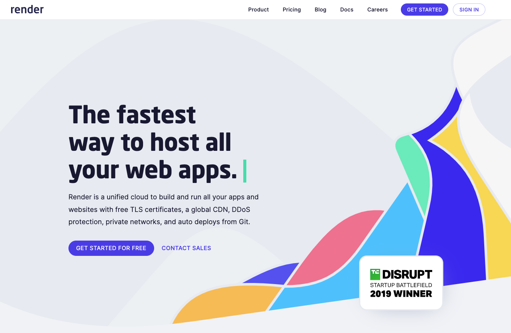

- PaaS の新興勢力 [Render](https://render.com/)

- Heroku に対してバチバチに対抗意識を燃やしている．
    - [https://render.com/render-vs-heroku-comparison](https://render.com/render-vs-heroku-comparison)
    > We’ve built Render to help developers and businesses avoid the cost and inflexibility traps of legacy Platform-as-a-Service solutions like Heroku. Our customers often tell us Render is what Heroku could have been. This page explains why so many former Heroku customers consider Render to be the best Heroku alternative.

- Heroku の Dyno は Hobby プラン（$7/月，RAM 512MB）の上が Standard-1X プラン（$25/月，RAM 512MB）， Standard-2X プラン（$50/月，RAM 1GB），であるのに対し， Render は Starter プラン（$7/月，RAM 512MB）の上が Starter Plus プラン（$15/月，RAM 1GB），Standard プラン（$25/月，RAM 2GB）．大きなRAMが必要な場合は Render の方が安いかもしれない．

- Heroku の Postgres は無料プラン（ストレージ 1GB，1万件）の上が， Hobby Basic プラン（$9/月，ストレージ 10GB，1000万件）， Standard 0 プラン（$50/月，ストレージ 64GB），であるのに対し， Render は無料プラン（ストレージ 1GB，件数無制限，ただし90日間）の上が， Starter プラン（$7/月，ストレージ 1GB）， Standard プラン（$20/月，RAM 16GB）． Render はデータベースの件数制限が無いため， Starter プランで十分かもしれない．そうすると結局 Heroku よりも安上がりで済むかもしれない．

- Render はリージョン（物理的なサーバーの所在地）としてシンガポールも選べる． Heroku はアメリカかヨーロッパしか選べなかった．

## Render でデプロイする

### 1. oTree プロジェクトを GitHub にアップロード（Push）する

- リポジトリのルートに `settings.py`， `requirements.txt`，各アプリのディレクトリなどを配置する．
- Heroku で必要だった `Procfile` （起動時のコマンドを指定）， `runtime.txt` （Pythonのバージョンを指定）の2ファイルは不要．

### 2. Render で PostgreSQL のインスタンスを作成しておく

- 動作確認で PostgreSQL が不要であればスキップしても良い．

- 「New +」を押して，「PostgreSQL」を選択．

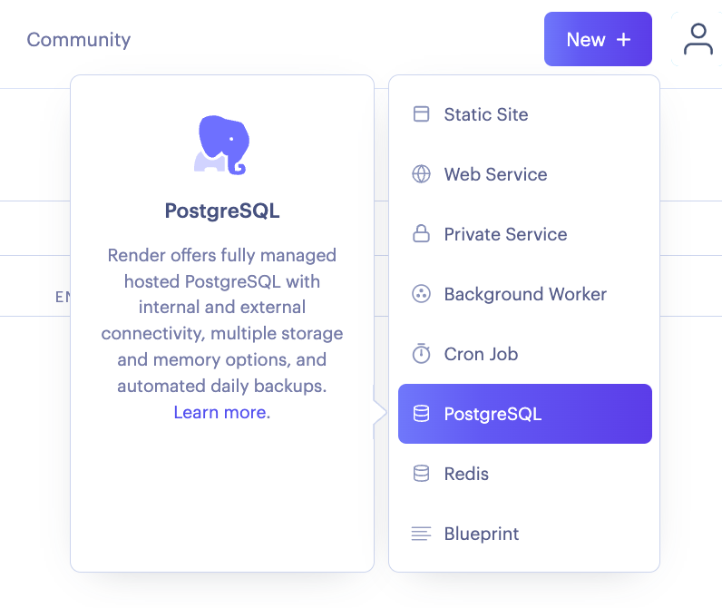

- 設定
    - Name: インスタンスの名前（何でも良い）
    - Database: PostgreSQL上でのデータベース名（空欄で良い）
    - User: PostgreSQL上でのユーザー名（空欄で良い）
    - Region: Singapore（日本で実施する場合）
    - PostgreSQL Version: 通常は14
    - Datadog API Key: 必要に応じて

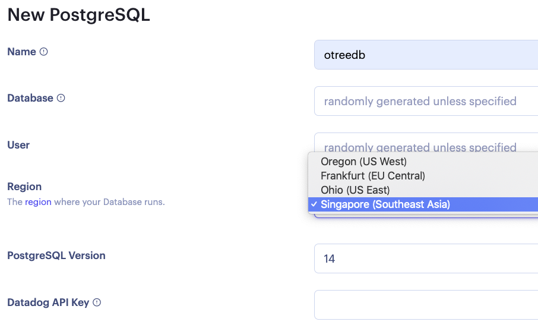

- プラン選択 → 「Create Database」を押す．
    - とりあえず Free を選んでおく．

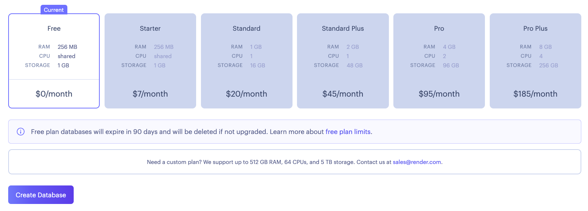

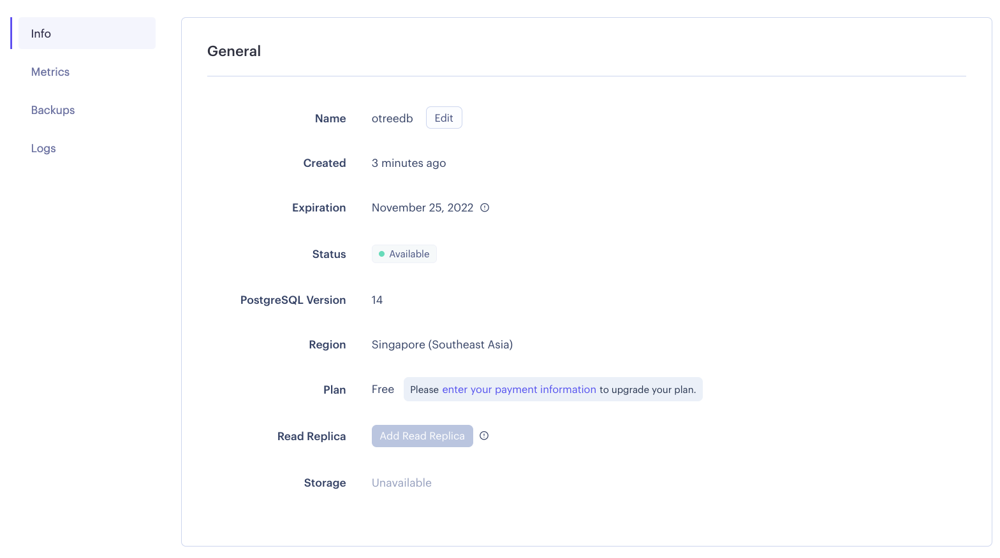

- インスタンス作成後，「Info」ページ「Connections」の「Internal Database URL」をコピーして控えておく．

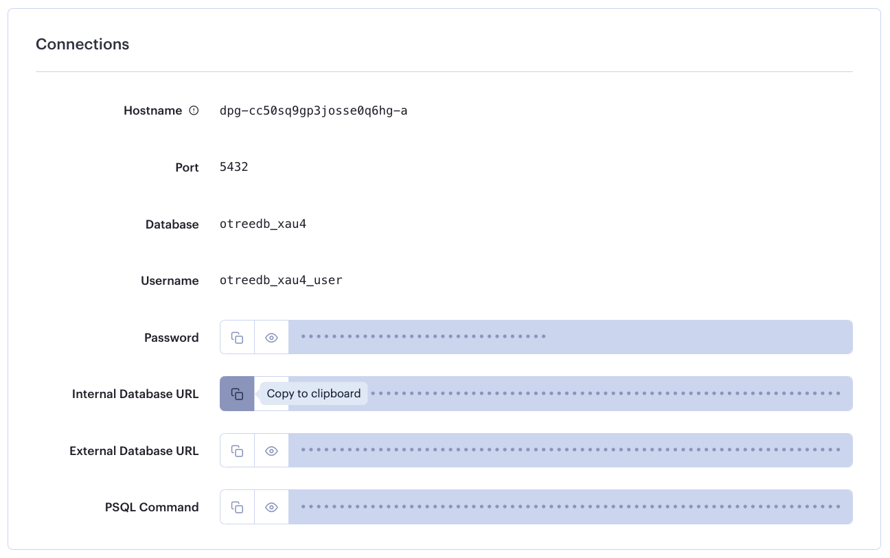

### 3. デプロイする

- 「New +」を押して，「Web Service」を選択．

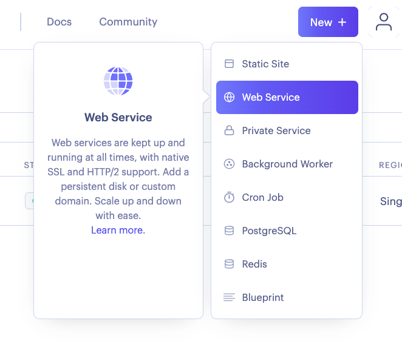

- （初回のみ） GitHub のアカウントと接続する．

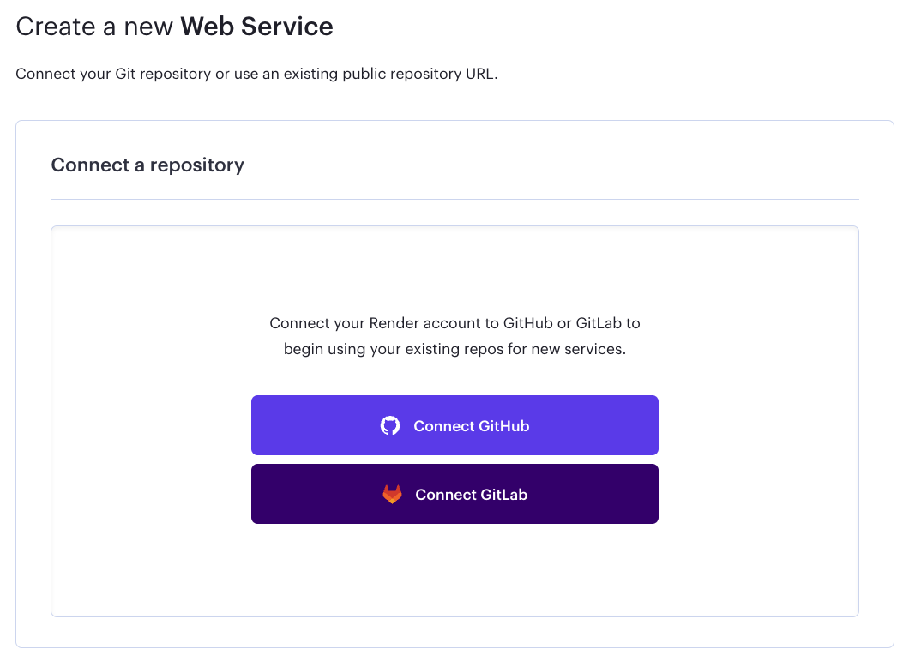

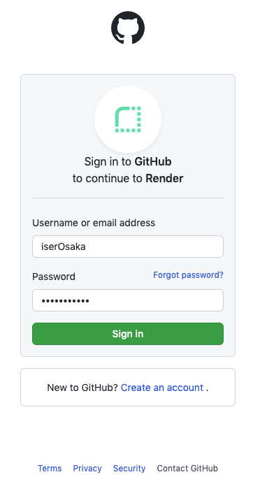

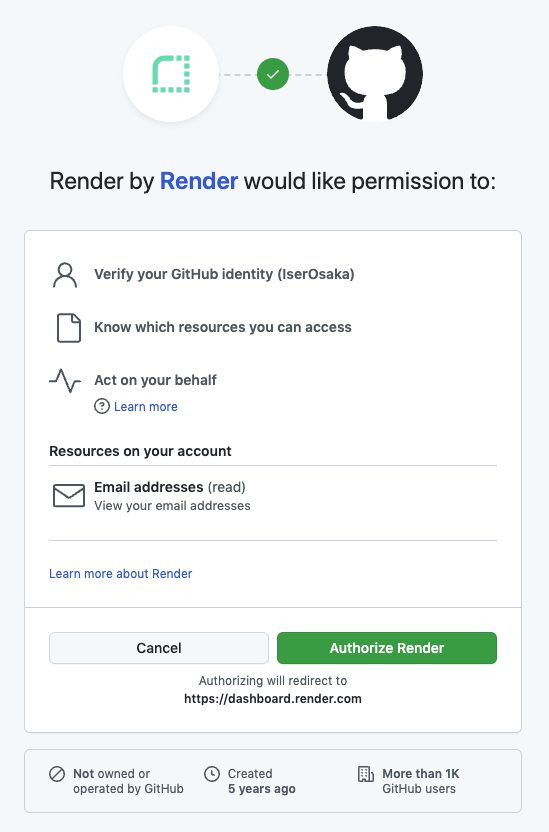

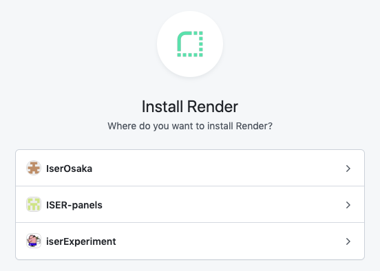

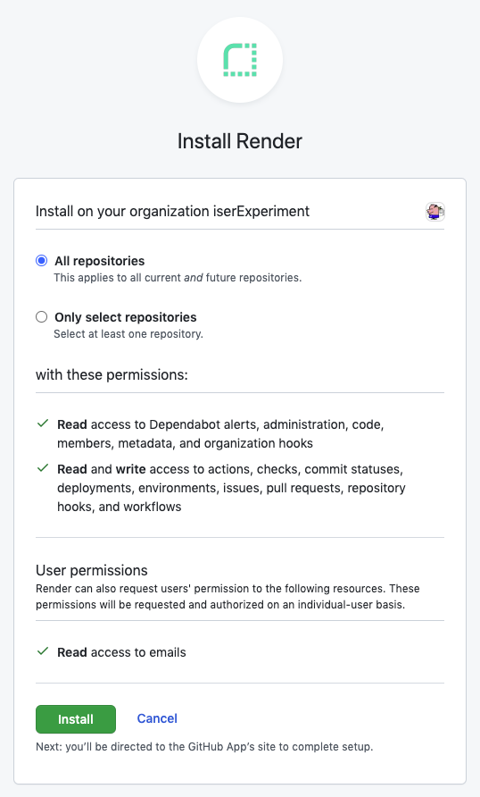

- デプロイしたいリポジトリを選択する．

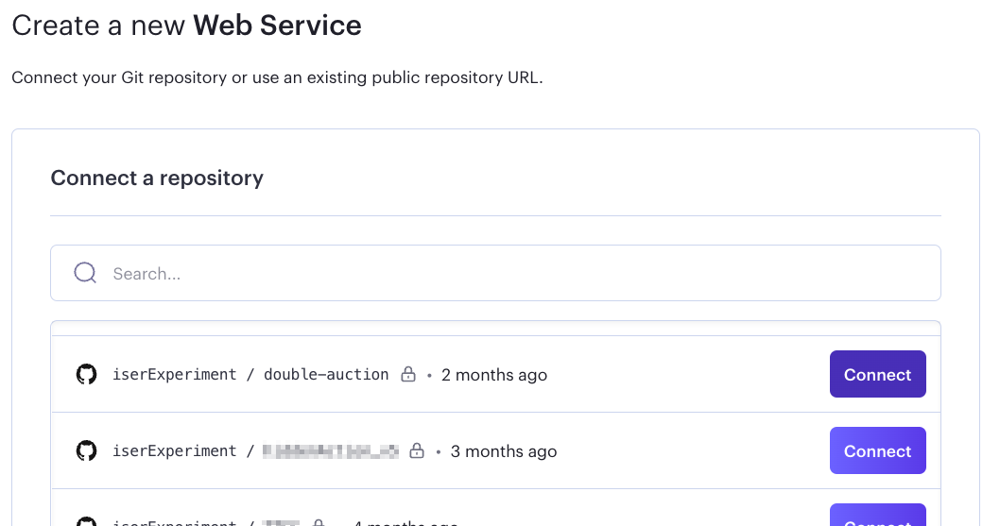

- 設定
    - Name: インスタンス名（この文字列がURLの一部になるので，参加者に見せてはいけない文字列にはしない．）
    - Environment: Python 3
    - Region: Singapore（日本で実施する場合）
    - Branch: GitHubリポジトリのブランチ名
    - Build Command: `pip install -r requirements.txt`
    - Start Command: `otree prodserver`

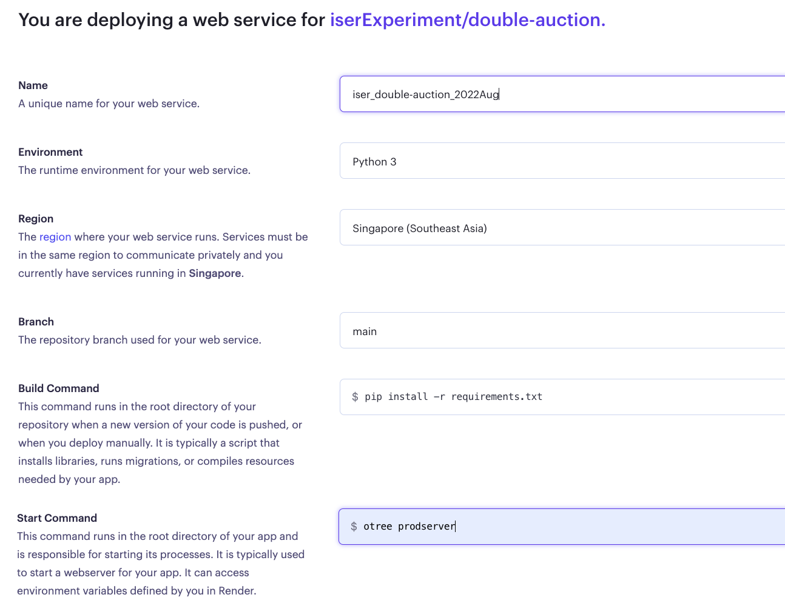

- プランの選択
    - とりあえず Free を選んでおく．
    - まだ「Create Web Service」は押さない．

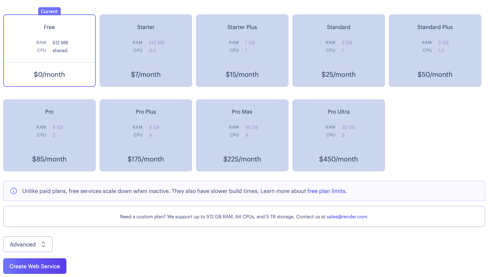

- 「Advanced」を押して，環境変数を設定する．
    - `PYTHON_VERSION`: 使うPythonのバージョンを指定する．
    - `OTREE_ADMIN_PASSWORD`
    - `OTREE_AUTH_LEVEL`
    - `OTREE_PRODUCTION`
    - `DATABASE_URL`: PostgreSQL インスタンスの「Internal Database URL」（`postgres://` から始まる文字列）．指定しなければデータベースとしてSQLiteが使われる．

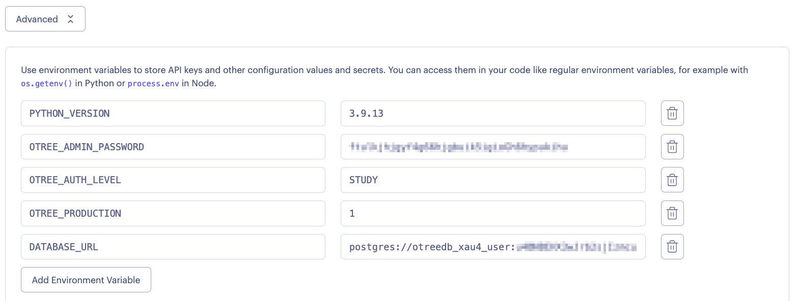

- 「Create Web Service」を押すとデプロイが開始する．

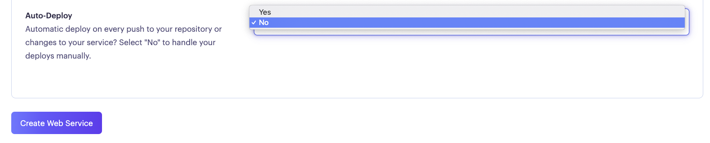

- ターミナル画面で「Starting service with 'otree prodserver'」と表示されたらデプロイ完了．

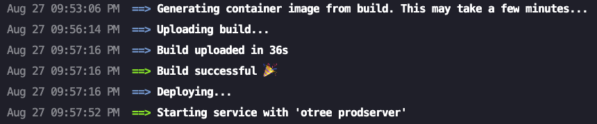

- インスタンス名の下に表示されているURLにアクセスするとoTreeのページへ行けるはず．

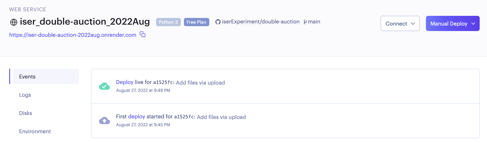

### 4. 設定変更の反映

- デプロイ後に環境変数を編集した場合，もう一度デプロイし直さないと反映されない．
- 無料プランの場合，一ヶ月にできるデプロイ作業は400回までなので，要注意．

### 5. データベースのリセット

- 無料プランではシェルが使えないため， `otree resetdb` が使えない．したがって PostgreSQL を作り直す．
